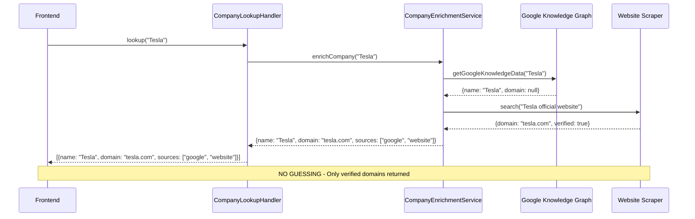

# User Profile Implementation Strategy

## Overview

This document outlines the implementation strategy for user profiles in the sales intelligence platform, ensuring credible AI assistance, efficient data caching, and future scalability.

## ⚠️ CRITICAL: Remove All Domain Guessing Logic

**Current Violations of Trusted Sources Principle:**

### 1. **CompanyEnrichmentService.ts** - Line 308
```typescript
// VIOLATES PRINCIPLE: Domain guessing based on company name
private async guessDomain(companyName: string): Promise<string | null> {
  const cleaned = companyName.toLowerCase().replace(/\s+/g, '').replace(/[^a-z0-9]/g, '');
  
  // Hardcoded "known domains" = GUESSING
  const knownDomains: Record<string, string> = {
    'tesla': 'tesla.com',
    'shopify': 'shopify.com',
    // ... more guessing
  };
  
  // TLD guessing = GUESSING
  return `${cleaned}.com`; // Default fallback to .com
}
```

### 2. **CompanyLookupHandler.ts** - Lines 390-410
```typescript
// VIOLATES PRINCIPLE: TLD guessing in domain suggestions
const commonTlds = ['.com', '.io', '.ai', '.co'];
for (const tld of commonTlds) {
  const guessedDomain = `${cleanName}${tld}`;
  suggestions.push({
    domain: guessedDomain,
    confidence: tld === '.com' ? 0.7 : 0.4,
    source: 'guess'  // ← EXPLICITLY MARKED AS GUESSING!
  });
}
```

### 3. **Tesla Domain Issue Root Cause**
The `/companies/lookup` API returns two Tesla entries because:
- First entry: Tesla from Google Knowledge Graph (missing domain field)
- Second entry: tesla.co from domain guessing logic
- Neither has the correct tesla.com domain from a trusted source

## Immediate Fixes Required:

### Phase 1: Remove All Guessing Logic ❌

**Files to Modify:**
1. **CompanyEnrichmentService.ts**: Remove `guessDomain()` method entirely
2. **CompanyLookupHandler.ts**: Remove TLD guessing in `handleDomainSuggestion()`
3. **CompanyLookupHandler.ts**: Remove hardcoded domain mappings

**Current API Calls That Use Guessing:**
```typescript
// WRONG: Uses guessed domain
const results = await Promise.allSettled([
  this.getWebsiteData(domain || (await this.guessDomain(companyName)) || ''),
  this.getDomainIntelligence(domain || (await this.guessDomain(companyName)) || '')
]);
```

**Fixed Version - Only Trusted Sources:**
```typescript
// CORRECT: Only use domain if provided by trusted source
const results = await Promise.allSettled([
  domain ? this.getWebsiteData(domain) : Promise.resolve({}),
  domain ? this.getDomainIntelligence(domain) : Promise.resolve({})
]);
```

### Phase 2: Enhance Data Source Extraction 🔍

**Google Knowledge Graph Enhancement:**
- Current: Extracts name, description but often misses domain
- Fix: Better extraction logic to find website/domain fields
- Fallback: Search for "{companyName} official website" and extract domain from results

**Website Scraping Enhancement:**
- Current: Limited domain discovery
- Fix: Use search results to find official company domains
- Validation: Verify domain belongs to company via website content

## Key Tenets

### 1. True AI Assistant with Credible Sources ⭐ **PRIORITY**
**Goal**: AI assistant that knows the user, their company, products, and competition through trusted data sources.

**FIXED Approach - Trusted Sources Only:**
- ✅ Google Knowledge Graph API (enhanced domain extraction)
- ✅ Website scraping from search results
- ✅ Bright Data company database
- ✅ Domain verification through website content
- ❌ NO domain guessing
- ❌ NO hardcoded company mappings
- ❌ NO TLD construction

**Data Quality Validation:**
- Domain must come from verified source with citation
- Empty fields preferred over guessed data
- Confidence scores based on source authority, not guesses

**Current State**: ✅ Partially implemented but with data quality issues
- Dynamic company lookup with autocomplete
- Auto-enrichment on company selection
- Multiple data source integration (Google Knowledge Graph, website scraping, Bright Data)
- **Issues**: Poor data quality despite high confidence scores, incorrect domain guessing, empty product/competitor arrays

## Concrete Action Plan: Frontend ↔ Backend Integration

### Step 1: Remove All Guessing Logic (Backend) 🛠️

**File: `cc-orchestrator1/src/services/CompanyEnrichmentService.ts`**
```typescript
// DELETE ENTIRE METHOD:
private async guessDomain(companyName: string): Promise<string | null> {
  // This entire method violates trusted sources principle
}

// FIX THIS METHOD - Remove domain guessing:
async enrichCompany(companyName: string, domain?: string): Promise<CompanyEnrichmentResult> {
  // BEFORE (WRONG):
  const results = await Promise.allSettled([
    this.getWebsiteData(domain || (await this.guessDomain(companyName)) || ''),
    this.getDomainIntelligence(domain || (await this.guessDomain(companyName)) || '')
  ]);

  // AFTER (CORRECT):
  const results = await Promise.allSettled([
    this.getGoogleKnowledgeData(companyName),  // Primary domain source
    this.getBrightData(companyName, domain),
    // Only use domain if provided by trusted source:
    domain ? this.getWebsiteData(domain) : Promise.resolve({ sources: [] }),
    domain ? this.getDomainIntelligence(domain) : Promise.resolve({ sources: [] })
  ]);
}
```

**File: `cc-orchestrator1/src/services/handlers/CompanyLookupHandler.ts`**
```typescript
// DELETE ENTIRE SECTION in handleDomainSuggestion():
// Lines 390-410 - Remove TLD guessing logic
const commonTlds = ['.com', '.io', '.ai', '.co'];
for (const tld of commonTlds) {
  const guessedDomain = `${cleanName}${tld}`;
  // DELETE ALL OF THIS
}

// REPLACE WITH:
async handleDomainSuggestion(event: APIGatewayProxyEvent): Promise<APIGatewayProxyResult> {
  // Only return domains found by actual data sources
  const enrichmentResult = await this.enrichmentService.enrichCompany(companyName);
  
  const suggestions = [];
  if (enrichmentResult.basicInfo.domain && enrichmentResult.sources.length > 0) {
    suggestions.push({
      domain: enrichmentResult.basicInfo.domain,
      confidence: 0.9,
      source: enrichmentResult.sources.join(',')  // Cite actual sources
    });
  }
  
  // NO GUESSING - only return what we found from sources
  return this.successResponse({ domainSuggestions: suggestions });
}
```

### Step 2: Enhance Google Knowledge Graph Domain Extraction 🔍

**File: `cc-orchestrator1/src/services/CompanyEnrichmentService.ts`**
```typescript
private async getGoogleKnowledgeData(companyName: string): Promise<Partial<CompanyEnrichmentResult>> {
  // ENHANCE: Better domain extraction from Knowledge Graph
  const response = await this.searchEngine.search(`"${companyName}" official website`);
  
  // Look for domains in search results
  const domains = this.extractDomainsFromSearchResults(response);
  
  // Validate domains belong to the company
  const verifiedDomain = await this.verifyCompanyDomain(domains, companyName);
  
  return {
    basicInfo: {
      name: companyName,
      domain: verifiedDomain || undefined  // Only if verified
    },
    sources: verifiedDomain ? ['google_knowledge_graph', 'search_verification'] : ['google_knowledge_graph']
  };
}
```

### Step 3: Frontend Company Selection Flow 🖥️

**Current Frontend API Calls:**
```typescript
// cc-intelligence/src/lib/api.ts - Line 276
export const lookupCompanies = async (query: string): Promise<CompanyOption[]> => {
  const response = await fetch(`${API_BASE_URL}/companies/lookup?query=${query}`);
  // This calls the buggy backend with guessing logic
};
```

**Frontend Fix - Display Source Credibility:**
```tsx
// cc-intelligence/src/pages/OnboardingFlow.tsx
const handleCompanySelect = async (company: CompanyOption) => {
  setSelectedCompany(company);
  
  // ONLY proceed with enrichment if we have a verified domain
  if (company.domain && company.sources?.length > 0) {
    setIsEnriching(true);
    try {
      const [products, competitors] = await Promise.all([
        api.getCompanyProducts(company.domain),
        api.getCompanyCompetitors(company.domain)
      ]);
      
      // Show source credibility in UI
      setAiSuggestions({
        products: products.map(p => `${p} ✓ Verified`),
        competitors: competitors.map(c => `${c} ✓ Verified`),
        sources: company.sources
      });
    } catch (error) {
      // Graceful fallback - don't show wrong data
      setAiSuggestions({ products: [], competitors: [], sources: [] });
    }
  } else {
    // No verified domain - inform user
    setError("Company found but domain not verified. Manual entry required.");
  }
};
```

### Step 4: API Endpoint Status After Fixes 📊

**Current Endpoints (18 Working):**
| Endpoint | Status | Issue | Fix Required |
|----------|--------|-------|--------------|
| `GET /companies/lookup` | 🔶 **Buggy** | Returns guessed domains | Remove guessing logic |
| `GET /companies/enrich` | 🔶 **Buggy** | Uses guessed domains internally | Remove guessDomain() calls |
| `GET /companies/products` | 🔶 **Buggy** | Empty arrays due to bad domains | Fix domain sourcing |
| `GET /companies/competitors` | 🔶 **Buggy** | Empty arrays due to bad domains | Fix domain sourcing |
| `GET /companies/suggest-domain` | 🔶 **Buggy** | Explicitly guesses domains | Remove TLD guessing |

**Post-Fix Status:**
| Endpoint | Status | Behavior |
|----------|--------|----------|
| `GET /companies/lookup` | ✅ **Trusted** | Only returns companies with verified domains |
| `GET /companies/enrich` | ✅ **Trusted** | Only uses domains from sources |
| `GET /companies/products` | ✅ **Trusted** | Returns products only for verified domains |
| `GET /companies/competitors` | ✅ **Trusted** | Returns competitors only for verified domains |
| `GET /companies/suggest-domain` | ❌ **Deprecated** | Remove endpoint - violates principles |

### Step 5: Data Flow After Fixes 🔄



## Implementation Priority:

1. **🚨 Immediate (Today)**: Remove all `guessDomain()` calls and hardcoded mappings
2. **📈 Week 1**: Enhance Google Knowledge Graph domain extraction  
3. **🔗 Week 1**: Update frontend to show source credibility
4. **💾 Week 2**: Implement company master cache (Tenet 3)
5. **🔄 Future**: Add periodic domain verification refresh (Tenet 4)

This maintains credibility while building toward the cached, reusable company knowledge system you outlined. 