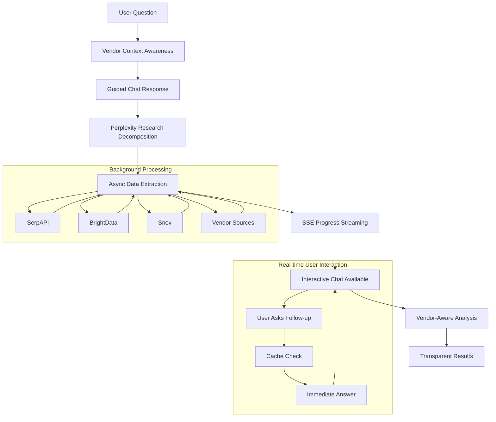

# Complete Integrated Architecture: The Ultimate Sales Intelligence System

## Overview

This document shows how **all five core components** integrate into one seamless, powerful sales intelligence system that provides unprecedented transparency, interactivity, and intelligence.

**The Five Pillars:**
1. 🗣️ **Guided Interactive Chat Experience**
2. ⚡ **Server-Sent Events (SSE) Streaming** 
3. 🔍 **Perplexity-Style Transparent Research**
4. 🔄 **Async Data Extraction (Step Functions)**
5. 🏢 **Vendor Context Awareness**

---

## 🎯 **Complete User Journey: Real Example**

### **User Input:**
```
"Help me prepare for my meeting with Acme Corp. I'm representing Okta and need to understand how to position our identity solution for their European expansion."
```

### **System Response: All 5 Components Working Together**

```
🏢 VENDOR CONTEXT AWARENESS (Background)
├── Detected: User represents Okta (Identity Management)
├── Loading: Okta's European capabilities, case studies, competitive advantages
├── Context: IAM market, GDPR compliance, European data centers

🗣️ GUIDED INTERACTIVE CHAT (Immediate)
├── "Great! I can see you're from Okta. Let me research Acme Corp for your meeting."
├── "🔄 Starting comprehensive research (2-3 minutes)"
├── "While that runs, what's your meeting objective?"
├── 🔘 "Renewal discussion" | 🔘 "New opportunity" | 🔘 "Expansion"

⚡ SSE STREAMING (Real-time updates)
├── event: vendor_context_loaded
├── event: research_plan_created  
├── event: sources_discovered
├── event: data_extracted
├── event: analysis_complete

🔍 PERPLEXITY TRANSPARENT RESEARCH (Live methodology)
🎯 Step 1: Question Breakdown
├── Acme Corp's European expansion plans
├── EU identity management challenges
├── Okta's competitive positioning in Europe
├── GDPR compliance requirements
└── Similar customer success stories

🏷️ Step 2: Research Topics
├── "Acme Corp European expansion funding timeline"
├── "EU GDPR identity management compliance"
├── "Okta European data centers customer success"
├── "Azure AD vs Okta European enterprise market"

🔍 Step 3: Source Discovery (with Okta context)
├── 📰 TechCrunch: Acme Corp Series C announcement
├── 📊 Gartner: European IAM market (Okta positioned as Leader)
├── 📚 Okta: EU data center documentation
├── 🎯 Okta: Similar FinTech customer case studies

🔄 ASYNC DATA EXTRACTION (Parallel processing)
├── SerpAPI: Latest Acme Corp news
├── BrightData: Company profile and tech stack
├── Snov: Decision maker contacts
├── Okta Internal: Relevant case studies and positioning

📊 Step 4: Data Extraction Results
✅ From TechCrunch: "$50M Series C specifically for European expansion"
✅ From Gartner: "Okta rated Leader in EU Identity Management"
✅ From Okta docs: "Frankfurt and London data centers, GDPR compliant"
✅ From case studies: "3 similar FinTech expansions using Okta"

🧠 Step 5: Vendor-Aware Analysis
✅ Synthesized with Okta's positioning and capabilities
✅ Recommendations tailored to Okta's strengths
✅ Competitive advantages highlighted
✅ Specific products and features recommended
```

**User can interact throughout:** 
- `"Tell me about the GDPR requirements"` → Instant answer with sources
- `"What Okta products fit their needs?"` → Vendor-aware recommendations
- `"Show me similar customer stories"` → Okta-specific case studies

---

## 🏗️ **Technical Architecture Integration**

### **1. Async Step Functions Orchestration**

```typescript
// MasterOrchestrationHandler.ts - Coordinates all components
export const masterOrchestrationHandler = async (event: OrchestrationEvent) => {
  const { userQuery, userPersona, chatSessionId } = event;
  
  // Component 5: Vendor Context Awareness
  const vendorContext = await vendorContextService.getContext(userPersona.company);
  await sseService.sendUpdate(chatSessionId, {
    type: 'vendor_context_loaded',
    context: vendorContext,
    message: `Loaded ${userPersona.company} positioning and capabilities`
  });
  
  // Component 3: Perplexity-Style Research Decomposition  
  const researchPlan = await transparentResearchService.decomposeQuestion(
    userQuery, 
    userPersona,
    vendorContext // Vendor-aware research planning
  );
  
  await sseService.sendUpdate(chatSessionId, {
    type: 'research_plan_created',
    plan: researchPlan,
    message: 'Created vendor-aware research plan'
  });
  
  // Component 4: Async Data Extraction (parallel)
  const dataExtractionPromises = researchPlan.topics.map(topic => 
    asyncDataExtractor.extract(topic, vendorContext)
  );
  
  // Component 2: SSE Streaming of progress
  const results = [];
  for await (const result of dataExtractionPromises) {
    results.push(result);
    await sseService.sendUpdate(chatSessionId, {
      type: 'data_extracted',
      source: result.source,
      data: result.data,
      vendorRelevance: result.vendorRelevance,
      message: `Extracted ${result.source.name} (${result.vendorRelevance}% relevant to ${userPersona.company})`
    });
  }
  
  // Vendor-aware synthesis
  const analysis = await vendorAwareLLMService.synthesize(
    results,
    vendorContext,
    userPersona
  );
  
  await sseService.sendUpdate(chatSessionId, {
    type: 'analysis_complete',
    analysis: analysis,
    researchTrail: {
      plan: researchPlan,
      sources: results.map(r => r.source),
      vendorContext: vendorContext
    },
    message: 'Analysis complete with vendor-specific recommendations'
  });
  
  return analysis;
};
```

### **2. SSE Event Stream Management**

```typescript
// SSEStreamManager.ts - Handles all real-time updates
export class SSEStreamManager {
  
  async handleChatSession(sessionId: string) {
    return new StreamingResponse(this.eventGenerator(sessionId), {
      headers: {
        'Content-Type': 'text/event-stream',
        'Cache-Control': 'no-cache',
        'Connection': 'keep-alive'
      }
    });
  }
  
  private async* eventGenerator(sessionId: string) {
    const session = await this.getSession(sessionId);
    
    // Component 1: Interactive chat capability
    yield this.formatSSE('session_init', {
      sessionId,
      vendorContext: session.vendorContext,
      availableInteractions: this.getAvailableInteractions(session)
    });
    
    // Component 5: Vendor context stream
    for await (const vendorUpdate of this.monitorVendorContext(session)) {
      yield this.formatSSE('vendor_context_update', vendorUpdate);
    }
    
    // Component 3: Research progress stream
    for await (const researchUpdate of this.monitorResearchProgress(session)) {
      yield this.formatSSE('research_progress', researchUpdate);
    }
    
    // Component 4: Data extraction stream
    for await (const dataUpdate of this.monitorDataExtraction(session)) {
      yield this.formatSSE('data_update', dataUpdate);
    }
    
    // Component 1: Chat interaction stream
    for await (const chatUpdate of this.monitorChatInteractions(session)) {
      yield this.formatSSE('chat_response', chatUpdate);
    }
    
    // Heartbeat
    while (true) {
      await this.sleep(30000);
      yield this.formatSSE('heartbeat', { timestamp: Date.now() });
    }
  }
  
  private formatSSE(eventType: string, data: any): string {
    return `event: ${eventType}\ndata: ${JSON.stringify(data)}\n\n`;
  }
}
```

### **3. Interactive Chat Handler**

```typescript
// InteractiveChatHandler.ts - Processes user questions during research
export class InteractiveChatHandler {
  
  async processUserQuestion(
    question: string,
    sessionId: string,
    currentWorkflowState: WorkflowState
  ): Promise<void> {
    
    const session = await this.getSession(sessionId);
    
    // Component 5: Vendor-aware question processing
    const questionWithContext = this.addVendorContext(question, session.vendorContext);
    
    // Component 3: Research-aware response
    const researchContext = this.getResearchContext(
      question,
      session.currentResearch
    );
    
    if (researchContext.canAnswerFromPartialData) {
      // Component 2: Immediate SSE response
      const answer = await this.generateAnswerFromPartialData(
        questionWithContext,
        researchContext.partialData,
        session.vendorContext
      );
      
      await this.sseManager.sendUpdate(sessionId, {
        type: 'chat_response',
        content: answer.content,
        sources: answer.sources,
        confidence: answer.confidence,
        vendorRecommendations: answer.vendorRecommendations
      });
      
    } else {
      // Component 4: Trigger targeted async extraction
      const targetedExtraction = await this.triggerTargetedExtraction(
        questionWithContext,
        session.vendorContext
      );
      
      await this.sseManager.sendUpdate(sessionId, {
        type: 'targeted_research_started',
        question: question,
        sources: targetedExtraction.sources,
        estimatedTime: targetedExtraction.estimatedTime
      });
    }
  }
  
  private addVendorContext(question: string, vendorContext: VendorContext): string {
    return `Context: User represents ${vendorContext.company} (${vendorContext.industry}). 
            Question: ${question}
            
            Please provide answers that consider ${vendorContext.company}'s 
            positioning, capabilities, and competitive advantages.`;
  }
}
```

### **4. Vendor-Aware Research Service**

```typescript
// VendorAwareResearchService.ts - Integrates vendor context into research
export class VendorAwareResearchService {
  
  async decomposeQuestion(
    question: string,
    userPersona: UserPersona,
    vendorContext: VendorContext
  ): Promise<ResearchPlan> {
    
    const prompt = `
    You are researching for a ${userPersona.role} at ${vendorContext.company}.
    
    Question: "${question}"
    
    Vendor Context:
    - Company: ${vendorContext.company}
    - Industry: ${vendorContext.industry}  
    - Key Products: ${vendorContext.products.join(', ')}
    - Competitive Advantages: ${vendorContext.advantages.join(', ')}
    - Target Markets: ${vendorContext.targetMarkets.join(', ')}
    
    Break this question down into research areas that will help position 
    ${vendorContext.company} effectively. Include:
    1. Customer analysis areas
    2. Competitive positioning research
    3. Product-market fit analysis
    4. Success story identification
    5. Risk/challenge assessment
    `;
    
    const researchPlan = await this.llmService.generateResearchPlan(prompt);
    
    // Enhance with vendor-specific research topics
    researchPlan.topics = researchPlan.topics.map(topic => ({
      ...topic,
      vendorRelevance: this.calculateVendorRelevance(topic, vendorContext),
      suggestedSources: this.suggestVendorSources(topic, vendorContext)
    }));
    
    return researchPlan;
  }
  
  private suggestVendorSources(topic: ResearchTopic, vendorContext: VendorContext): Source[] {
    const sources = [];
    
    // Add vendor-specific sources
    if (topic.category === 'competitive_analysis') {
      sources.push(...vendorContext.competitiveIntelSources);
    }
    
    if (topic.category === 'customer_success') {
      sources.push(...vendorContext.caseStudySources);
    }
    
    if (topic.category === 'product_positioning') {
      sources.push(...vendorContext.productDocumentationSources);
    }
    
    // Add general market sources
    sources.push(...this.getMarketSources(topic));
    
    return sources;
  }
}
```

---

## 🎯 **Frontend: Complete Integration**

### **React Component Architecture**

```typescript
// CompleteSalesIntelligence.tsx - Main integrated component
export const CompleteSalesIntelligence = () => {
  const [sessionId] = useState(() => generateSessionId());
  const [chatState, setChatState] = useState<ChatState>({
    messages: [],
    vendorContext: null,
    researchProgress: null,
    currentWorkflow: 'idle'
  });
  
  // Component 2: SSE Connection for all updates
  useEffect(() => {
    const eventSource = new EventSource(`/api/sse/session/${sessionId}`);
    
    // Component 5: Vendor context updates
    eventSource.addEventListener('vendor_context_loaded', (event) => {
      const data = JSON.parse(event.data);
      setChatState(prev => ({ ...prev, vendorContext: data.context }));
      addSystemMessage(`✅ Loaded ${data.context.company} positioning`);
    });
    
    // Component 3: Research progress updates
    eventSource.addEventListener('research_plan_created', (event) => {
      const data = JSON.parse(event.data);
      setChatState(prev => ({ 
        ...prev, 
        researchProgress: { ...prev.researchProgress, plan: data.plan }
      }));
      addSystemMessage(`🎯 Created research plan: ${data.plan.areas.length} areas`);
    });
    
    eventSource.addEventListener('data_extracted', (event) => {
      const data = JSON.parse(event.data);
      addSystemMessage(`📊 ${data.message}`, {
        type: 'data_extraction',
        source: data.source,
        vendorRelevance: data.vendorRelevance
      });
    });
    
    // Component 1: Chat responses
    eventSource.addEventListener('chat_response', (event) => {
      const data = JSON.parse(event.data);
      addAssistantMessage(data.content, data.sources, data.vendorRecommendations);
    });
    
    return () => eventSource.close();
  }, [sessionId]);
  
  // Component 1: Interactive chat during processing
  const handleUserQuestion = async (question: string) => {
    addUserMessage(question);
    
    await fetch('/api/chat/question', {
      method: 'POST',
      headers: { 'Content-Type': 'application/json' },
      body: JSON.stringify({
        sessionId,
        question,
        workflowState: chatState.currentWorkflow
      })
    });
    
    // Response comes via SSE
  };
  
  return (
    <div className="sales-intelligence-platform">
      {/* Component 5: Vendor Context Display */}
      {chatState.vendorContext && (
        <VendorContextPanel context={chatState.vendorContext} />
      )}
      
      {/* Component 3: Research Progress Visualization */}
      {chatState.researchProgress && (
        <ResearchProgressPanel progress={chatState.researchProgress} />
      )}
      
      {/* Component 1: Interactive Chat Interface */}
      <ChatInterface 
        messages={chatState.messages}
        onSendMessage={handleUserQuestion}
        vendorContext={chatState.vendorContext}
      />
      
      {/* Component 4: Data Extraction Status */}
      <DataExtractionStatus 
        extractions={chatState.activeExtractions}
        onSourceExplore={handleSourceExploration}
      />
    </div>
  );
};
```

### **Specialized UI Components**

```typescript
// VendorContextPanel.tsx - Component 5 visualization
export const VendorContextPanel = ({ context }) => (
  <div className="vendor-context-panel bg-blue-50 p-4 rounded-lg mb-4">
    <h3 className="font-semibold flex items-center">
      🏢 {context.company} Context
    </h3>
    <div className="grid grid-cols-3 gap-4 mt-2">
      <div>
        <span className="text-sm text-gray-600">Industry:</span>
        <span className="ml-2 font-medium">{context.industry}</span>
      </div>
      <div>
        <span className="text-sm text-gray-600">Key Products:</span>
        <span className="ml-2 font-medium">{context.products[0]}...</span>
      </div>
      <div>
        <span className="text-sm text-gray-600">Target Markets:</span>
        <span className="ml-2 font-medium">{context.targetMarkets.join(', ')}</span>
      </div>
    </div>
  </div>
);

// ResearchProgressPanel.tsx - Component 3 visualization  
export const ResearchProgressPanel = ({ progress }) => (
  <div className="research-progress bg-gray-50 p-4 rounded-lg mb-4">
    <ResearchSteps currentStep={progress.currentStep} />
    {progress.plan && <ResearchPlan plan={progress.plan} />}
    {progress.sources && <SourcesList sources={progress.sources} />}
    {progress.analysis && <VendorAwareAnalysis analysis={progress.analysis} />}
  </div>
);

// VendorAwareAnalysis.tsx - Combines components 3 + 5
export const VendorAwareAnalysis = ({ analysis }) => (
  <div className="vendor-aware-analysis">
    <div className="analysis-content mb-4">
      {analysis.content}
    </div>
    
    <div className="vendor-recommendations bg-green-50 p-3 rounded">
      <h4 className="font-semibold text-green-800">
        📈 {analysis.vendorContext.company} Recommendations:
      </h4>
      <ul className="mt-2 space-y-1">
        {analysis.vendorRecommendations.map((rec, index) => (
          <li key={index} className="flex items-start">
            <span className="text-green-600 mr-2">•</span>
            <span className="text-sm">{rec}</span>
          </li>
        ))}
      </ul>
    </div>
    
    <div className="sources-section mt-4">
      <h4 className="font-semibold">Sources & Evidence:</h4>
      <SourceExplorationList 
        sources={analysis.sources}
        vendorContext={analysis.vendorContext}
      />
    </div>
  </div>
);
```

---

## 🔄 **Complete Data Flow**

### **The Five Components Working Together:**



---

## 🎯 **Key Integration Benefits**

### **1. Seamless User Experience**
- **Immediate engagement** (Component 1: Guided Chat)
- **Real-time transparency** (Component 2: SSE + Component 3: Research)
- **Vendor relevance** (Component 5: Context awareness)
- **No waiting** (Component 4: Async processing)

### **2. Professional Credibility**
- **Complete source attribution** (Component 3: Perplexity methodology)
- **Vendor-specific recommendations** (Component 5: Context awareness)
- **Research audit trail** (Component 2: SSE logging)
- **Interactive verification** (Component 1: Chat exploration)

### **3. Scalable Architecture**
- **SSE scales infinitely** (Component 2: No WebSocket overhead)
- **Async processing** (Component 4: Step functions scale independently)
- **Stateless chat** (Component 1: Standard HTTP)
- **Cached vendor context** (Component 5: Reusable across sessions)

### **4. Competitive Advantage**
- **No other platform** combines all five components
- **Transparent + Interactive** = Unique in market
- **Vendor-aware intelligence** = Business-relevant insights
- **Real-time exploration** = Superior user engagement

---

## 🚀 **Implementation Roadmap**

### **Phase 1: Core Integration**
1. ✅ **Vendor Context Service** - Load and cache vendor capabilities
2. ✅ **SSE Stream Manager** - Handle all real-time updates
3. ✅ **Interactive Chat Handler** - Process questions during workflows
4. ✅ **Basic Research Decomposition** - Perplexity-style planning

### **Phase 2: Advanced Features**
1. ✅ **Transparent Data Extraction** - Real-time source discovery
2. ✅ **Vendor-Aware Analysis** - Context-specific recommendations
3. ✅ **Source Exploration UI** - Interactive citation drilling
4. ✅ **Research Progress Visualization** - Complete transparency

### **Phase 3: Enterprise Features**
1. ✅ **Multi-vendor support** - Different company contexts
2. ✅ **Collaborative research** - Team-based intelligence
3. ✅ **API access** - Programmatic integration
4. ✅ **Advanced analytics** - Research effectiveness metrics

---

## 🎯 **Conclusion: The Ultimate Sales Intelligence System**

By integrating all five components, we create a system that:

- ✅ **Engages immediately** with guided chat
- ✅ **Streams progress** in real-time via SSE  
- ✅ **Shows methodology** with Perplexity transparency
- ✅ **Processes background data** with async extraction
- ✅ **Provides vendor context** for relevant recommendations

**Result:** A sales intelligence platform that combines the interactivity of ChatGPT, the transparency of Perplexity, the real-time capabilities of streaming platforms, and the business relevance of vendor-aware AI.

This creates an experience no other platform offers: **transparent, interactive, vendor-aware intelligence that users can trust for critical business decisions.**

*Next: Ready to implement this complete integrated architecture?* 